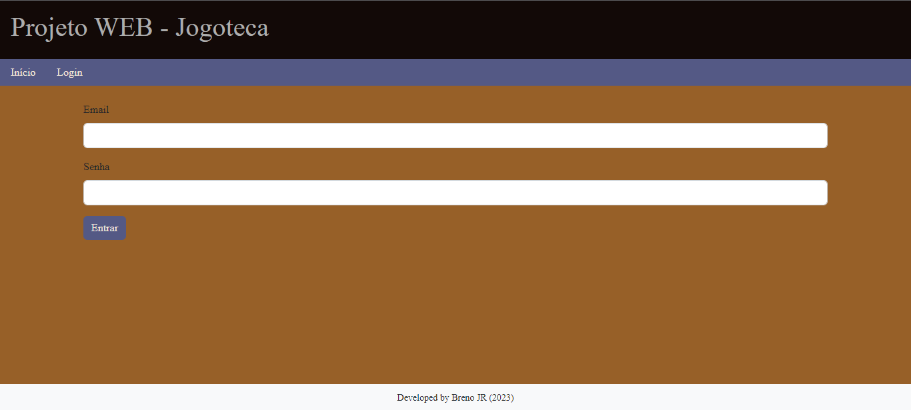

<h1 align="center"> Jogoteca </h1>

## :clipboard: Informações

:bookmark: <strong>Nome:</strong> Breno Junior

:green_book: <strong>Disciplina:</strong> WEB

:school: <strong>Instituição:</strong> IFMG

## :scroll: Descrição do projeto

Esse é um código feito pelo Breno Jr, desenvolvido na disciplina de WEB II. Esse código basicamente cadastra jogos por meio do uso do HTML e do Flask, armazenando-os e listando-os na tela do usuario.

## :white_check_mark: Funcionalidades do projeto

- <strong>Funcionalidade 1:</strong> Visualizar nome de jogos e suas respectivas categorias e plataformas.
- <strong>Funcionalidade 2:</strong> Cadastrar novos jogos na tabela e suas respectivas informações.

## :page_with_curl: Instruções sobre o projeto

Essa é a tela inicial, na qual você pode observar os seguintes jogos listados:

Para adicionar mais jogos na jogoteca, voce precisa estar logado. Para isso, basta clicar no botão de login e assim você será direcionado a essa página:

Agora basta você escrever o seu login e senha, como no exemplo a seguir:

Otimo! Você agora está logado. Para adicionar mais jogos clique no botão "Cadastrar", e logo após você será direcionado a essa página:

Agora basta preencher o formulário, como no exemplo:

Pronto! O jogo está cadastrado:

## :framed_picture: Autor

[ Breno JR](https://instagram.com/brenotjunior)
